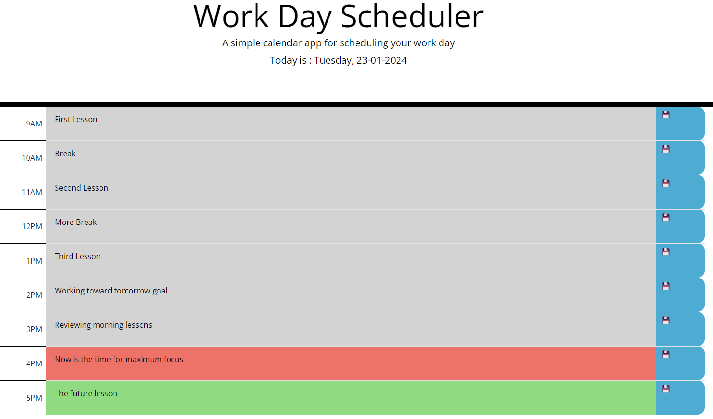

# Daily-Planner-App-CristianB

Daily Planner App - part of Bootcamp challenge

## Description

This Project was created for bootcamp challenge.

It tests the knowledge gained in HTML, CSS, JavaScript, JQuery, and Dayjs during the last weeks, especially the implementation of JavaScript. 

This is how it looks:

## Installation

The repository is on the GitHub repositories public domain .... and the deployed webpage can be found at .... where it was deployed using GitHub

## Usage

The code is free to be used according to the licence condition (please see the licence file from the GitHub repository)

## Credits

- Bootcamp EDX ( a big cheers for bootcamp teachers! ) provided the needed **materials**, the most wanted **inspiration** and the difficult to obtain **motivation**  

  
- Bootstrap - used for **table** model

        https://getbootstrap.com/docs/5.3/content/tables/

- Xpert Learning Assistant - the Bootcamp Course AI, used for helping with some of the javascript syntax
 
         https://bootcampspot.instructure.com/courses

- Markdown Guide used for styling the readme.md

         https://www.markdownguide.org/basic-syntax/

## License

MIT license

